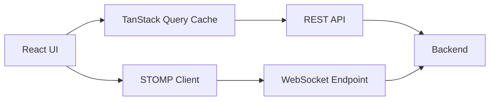
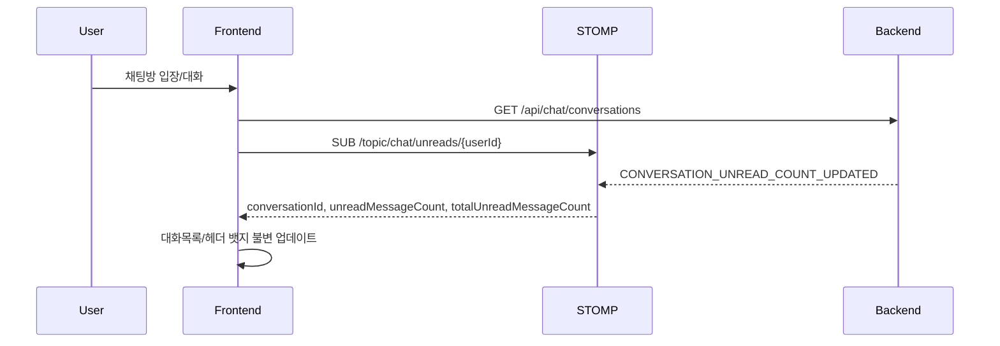
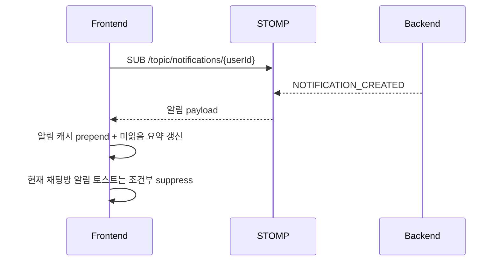

# Blog Pulse Frontend

[](https://react.dev/)
[](https://www.typescriptlang.org/)
[](https://vitejs.dev/)
[](https://tanstack.com/query)

실시간 커뮤니티 경험을 목표로 만든 React + TypeScript 프론트엔드입니다.  
게시글, 댓글, 채팅, 알림, 마이페이지를 단일 앱으로 통합했고, 실시간 동기화와 모바일 UX를 핵심으로 설계했습니다.

## 프로젝트 하이라이트

- 실시간 채팅 + 실시간 미읽음 카운트 동기화
  - STOMP 구독 이벤트를 기준으로 목록/헤더 뱃지를 즉시 업데이트
- 실시간 알림 + 자동 무한 스크롤
  - 더보기 버튼 없이 Intersection Observer로 자연스럽게 로드
- 반응형 메신저 UX
  - 모바일 풀스크린 채팅 패널, 키보드/뷰포트 변동 대응, 스크롤 안정화
- 소셜 반응 시스템
  - 게시글 좋아요, 댓글 좋아요/싫어요, 낙관적 업데이트 + 실패 롤백
- 마이페이지 통합
  - 요약/내 게시글/내 댓글 병렬 조회, 프로필 수정 캐시 동기화
- 운영 친화적 네트워크 전략
  - API 응답 래퍼/원시 응답 동시 지원, snake_case/camelCase 정규화, 토큰 갱신 흐름 내장

## 기능 개요

| 도메인 | 사용자 기능 | 구현 포인트 |
| --- | --- | --- |
| 인증 | 로그인/회원가입, 자동 로그인 | `/auth/me` 동기화, 토큰/사용자 상태 일관성 유지 |
| 게시글 | 목록/상세/작성, 리치 텍스트 작성 | Tiptap 기반 에디터, TUS 업로드 |
| 댓글 | 댓글 CRUD | 모달 기반 확인/안내, 반응(좋아요/싫어요) 연결 |
| 채팅 | 대화방/메시지/읽음/나가기 | STOMP 실시간 수신, unread 이벤트 반영, 불변 캐시 업데이트 |
| 알림 | 드롭다운/목록/읽음/전체읽음 | 실시간 수신, 미읽음 요약 캐시, 자동 무한 스크롤 |
| 마이페이지 | 프로필/통계/활동 내역 | 병렬 로딩, 낙관적 프로필 갱신 |

## 아키텍처



### 실시간 채팅 미읽음 동기화 흐름



### 실시간 알림 흐름



## 기술 스택

| 영역 | 기술 |
| --- | --- |
| Core | React 19, TypeScript, Vite |
| Routing | React Router |
| Server State | TanStack Query v5 |
| HTTP | Axios |
| Realtime | WebSocket + STOMP(Frame 직접 처리) |
| Editor/Upload | Tiptap, tus-js-client |
| UI | Tailwind CSS, Radix UI, shadcn/ui 기반 컴포넌트 |
| Feedback | react-toastify |

## 프로젝트 구조

```txt
src
├─ app
│  ├─ layout.tsx            # 상단/하단 네비, 전역 브릿지
│  ├─ router.tsx            # 라우팅
│  └─ providers.tsx         # Query/Auth/Theme/Toast Provider
├─ features
│  ├─ user                  # 인증
│  ├─ post                  # 게시글/에디터
│  ├─ comment               # 댓글
│  ├─ chat                  # 채팅 + 미읽음 실시간
│  ├─ notifications         # 알림 + 실시간
│  └─ social                # 좋아요/댓글반응/마이페이지
└─ shared
   ├─ lib                   # api/auth/network 유틸
   ├─ socket                # STOMP 클라이언트
   ├─ context               # Auth/Theme
   └─ ui                    # 공통 UI
```

## 시작하기

### 1) 요구 사항

- Node.js 20+
- npm 10+

### 2) 설치

```bash
npm install
```

### 3) 환경 변수

`.env` 파일을 생성해 값을 채우세요.

```env
VITE_API_BASE_URL="http://localhost:8080/api"
```

| 변수 | 기본 동작 | 설명 |
| --- | --- | --- |
| `VITE_API_BASE_URL` | 런타임 기준 자동 계산 | REST API 베이스 URL |
| `VITE_AUTH_REFRESH_URL` | `${VITE_API_BASE_URL}/auth/refresh` | 토큰 재발급 URL |
| `VITE_WS_URL` | 미지정 시 후보 자동 탐색 | WebSocket URL (쉼표로 다중 후보 가능) |
| `VITE_STOMP_DEBUG` | `false` | STOMP 프레임 디버그 로그 |
| `VITE_DEV_USER_ID` | 없음 | 개발용 사용자 ID fallback |

### 4) 실행

```bash
# 개발 서버
npm run dev

# 빌드
npm run build

# 린트
npm run lint

# 프리뷰
npm run preview
```

## 상태 관리 및 데이터 전략

- 서버 상태는 TanStack Query로 일원화
- 채팅/알림 실시간 이벤트 수신 시 목록 재조회 없이 캐시 불변 업데이트
- 좋아요/댓글 반응/프로필 수정은 낙관적 업데이트 적용
- 실패 시 롤백 + 토스트 피드백으로 UX 안정성 확보

## API 연동 정책

기본 응답 형식은 다음 래퍼를 기준으로 처리합니다.

```json
{
  "status": "OK",
  "success": true,
  "message": "요청 성공",
  "data": {}
}
```

추가로 다음 케이스도 흡수합니다.

- 래퍼 없이 원시 데이터 응답
- `snake_case`/`camelCase` 필드 혼용
- 일부 엔드포인트의 구조 편차

## 모바일 UX 포인트

- `viewport-fit=cover`, `interactive-widget=resizes-content` 기반 뷰포트 대응
- 모바일 채팅 진입 시 상하단 chrome 제어 및 오버레이 분리
- 키보드 등장 시 visual viewport 기준 패널 높이 동기화
- 채팅 자동 스크롤은 `auto` 기준으로 안정성 우선

## 품질 관리

- 타입 안정성: `npm run build` 단계에서 `tsc -b` 수행
- 코드 스타일: ESLint 적용
- 현재 저장소에는 채팅 표시 로직 테스트 스펙(`tests/features/chat`)이 포함되어 있습니다.

## 라우트 맵

| 경로 | 설명 |
| --- | --- |
| `/login` | 로그인 |
| `/register` | 회원가입 |
| `/posts` | 게시글 목록 |
| `/posts/create` | 게시글 작성 |
| `/posts/:id` | 게시글 상세 |
| `/chat` | 채팅 |
| `/notifications` | 알림 목록 |
| `/mypage` | 마이페이지 |

## 커밋 컨벤션

```txt
feat(scope): 기능 추가
fix(scope): 버그 수정
refactor(scope): 구조 개선
```

예시:

```txt
feat(chat): 실시간 미읽음 동기화 추가
fix(auth): /auth/me 인증 헤더 처리 정리
```